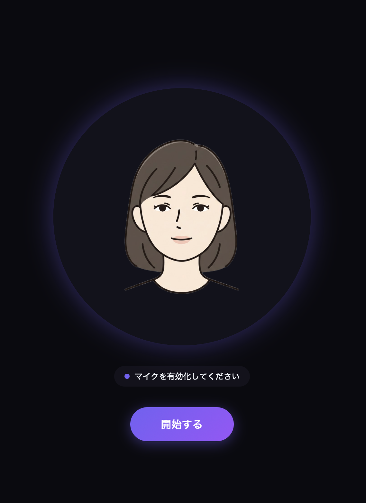

# Web音声アバターアプリ



Gemini Live API を使用した音声会話アバターアプリケーションです。

## 構成

```
avator_basic_python/
├── backend_python/  # Python Proxy Server (FastAPI + uv)
│   ├── main.py
│   ├── pyproject.toml
│   └── .env.example
└── frontend/        # React (Vite) Application
    ├── src/
    │   ├── App.jsx
    │   ├── main.jsx
    │   └── index.css
    └── public/
        ├── audio-processor.js
        ├── avatar-closed.png  # ← 用意してください（口閉じ）
        └── avatar-open.png    # ← 用意してください（口開き）
```

## セットアップ

### 1. 環境変数の設定

```bash
cd backend_python
cp .env.example .env
# .env ファイルを編集して GEMINI_API_KEY を設定
```

### 2. バックエンドの起動

Python環境管理ツール `uv` を使用します。

```bash
cd backend
uv run uvicorn main:app --reload --port 8080
```

※ 初回実行時に自動的に依存関係がインストールされます。

### 3. フロントエンドの起動

```bash
cd frontend
npm install
npm run dev
```

### 4. アバター画像の配置

`frontend/public/` に以下の2枚の画像を配置してください：
- `avatar-closed.png` - 口を閉じた状態
- `avatar-open.png` - 口を開いた状態

### 5. アクセス

ブラウザで http://localhost:3000 を開く

## 使い方

1. 「開始する」ボタンをクリック
2. マイクへのアクセスを許可
3. 話しかけるとアバターが応答します
