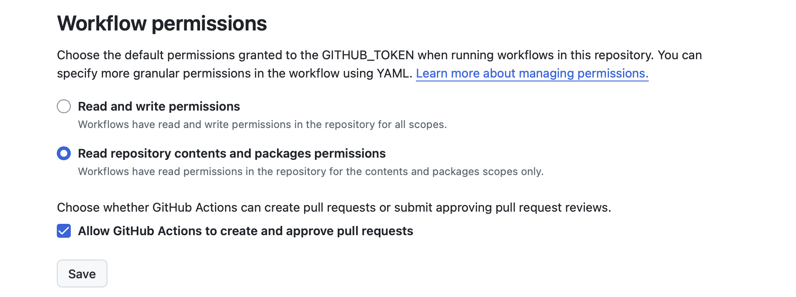

# CI/CD設定について

このプロジェクトのバックエンド（Python）用CI/CDパイプラインについて説明します。

## 概要

GitHub Actionsを使用して、コードがプッシュされるたびに自動的なチェックを行っています。
現在は以下のワークフローが設定されています。

### Python Syntax Check

- **ファイル**: `.github/workflows/ci.yml`
- **トリガー**: `main` ブランチへの Push または Pull Request
- **対象ディレクトリ**: `backend_python/`

#### 実行内容

1. **Python環境のセットアップ**: `backend_python/.python-version` で指定されたバージョン（現在は 3.13）を使用します。
2. **依存関係のインストール**: `uv` を使用して高速に依存関係をインストールします。
3. **構文チェック**: `compileall` モジュールを使用して、Pythonファイルに構文エラーがないかを確認します。

```bash
# ローカルでの実行コマンド例（backend_pythonディレクトリ内で）
uv run python -m compileall . -q
```

このチェックにより、基本的な記述ミス（インデントエラーや閉じていない括弧など）を早期に発見します。

### Frontend Build

- **ファイル**: `.github/workflows/ci.yml`（`frontend-build` job）
- **トリガー**: `main` ブランチへの Push または Pull Request
- **対象ディレクトリ**: `frontend/`

#### 実行内容

1. **環境セットアップ**: Node.js 20を使用。
2. **依存関係インストール**: `npm ci` で `package-lock.json` に基づきインストール。
3. **ビルド**: `npm run build` (Vite build) を実行。

ビルドが成功すれば、基本的な構文エラーがないことが保証されます。

```bash
# ローカルでの実行コマンド例（frontendディレクトリ内で）
npm install
npm run build
```

### Cloud Run Deployment

- **ファイル**: `.github/workflows/deploy-production.yml`（`deploy_backend` job）
- **トリガー**: `main` ブランチへのマージ
- **対象ディレクトリ**: `backend/`
- **デプロイ先**: Google Cloud Run（asia-northeast1）

#### 実行内容

1. **Google Cloud認証**: サービスアカウントキーを使用してGCPに認証
2. **Dockerイメージのビルド**: `backend/Dockerfile` を使用してイメージをビルド
3. **GCRへのプッシュ**: Google Container Registry にイメージをプッシュ
4. **Cloud Runへのデプロイ**: 
   - サービス名: `avatar-backend`
   - リージョン: `asia-northeast1`
   - 環境変数: `GEMINI_API_KEY`, `FIREBASE_SERVICE_ACCOUNT`
   - 認証: 未認証アクセスを許可

```bash
# ローカルでのDockerビルドテスト（backendディレクトリ内で）
docker build -t avatar-backend:test .
docker run -p 8080:8080 \
  -e GEMINI_API_KEY="your_key" \
  -e FIREBASE_SERVICE_ACCOUNT='{"type": "service_account", ...}' \
  avatar-backend:test
```


### PR Preview Deployment

- **ファイル**: `.github/workflows/ci.yml`（`deploy-preview` job）
- **トリガー**: Pull Requestの作成・更新
- **対象**: フロントエンドのみ
- **デプロイ先**: Firebase Hosting プレビューチャンネル

#### 実行内容

1. **テストの実行**: `test-backend` と `test-frontend` ジョブが並列実行
2. **ビルドアーティファクトの保存**: `test-frontend` でビルドした成果物を保存
3. **プレビューデプロイ**: 保存したアーティファクトを使用してFirebase Hostingにデプロイ
4. **PR コメント**: プレビューURLがPRに自動的にコメントされる

**メリット**:
- テストとビルドが1回で完結（従来は2回）
- ビルド時間の短縮
- リソースの節約

```bash
# ローカルでのプレビュー確認（frontendディレクトリ内で）
npm run build
firebase hosting:channel:deploy preview-$(git rev-parse --short HEAD)
```


## github設定

forkまたはcloneしたリポジトリで、以下の手順で設定する。

### シークレットキーの設定 (GitHub Secrets)


GitHub CLI (`gh`) を使用して、必要なシークレットを一括で設定することをお勧めします。

#### 1. 設定用ファイルの作成

プロジェクトルートに `.env.secrets` というファイルを作成し、以下のシークレットを記述します。
（**注意**: `.env.secrets` は `.gitignore` に追加されており、リポジトリにはコミットされません）

```bash
# .env.secrets
FIREBASE_PROJECT_ID=ここにプロジェクトID (gen-lang-client-02446999-262c1)
GEMINI_API_KEY=ここにGeminiのAPIキー (AIza...)
GCP_PROJECT_ID=ここにGCPプロジェクトID (gen-lang-client-02446999-262c1)
```

> [!NOTE]
> `FIREBASE_PROJECT_ID` と `GCP_PROJECT_ID` は通常同じ値になります。

#### 2. シークレットの一括アップロード

ターミナルで以下のコマンドを実行し、`.env.secrets` の内容を一括で登録します。

```bash
gh secret set -f .env.secrets
```

#### 3. サービスアカウントキー (JSON) の登録

**Firebase Admin SDK用**と**Cloud Run デプロイ用**のサービスアカウントキーを登録します。

```bash
# Firebase Admin SDK用（バックエンドでのFirebase初期化に使用）
gh secret set FIREBASE_SERVICE_ACCOUNT < firebase-admin-sa-key.json

# Cloud Run デプロイ用（GitHub ActionsからCloud Runへのデプロイに使用）
gh secret set GCP_SA_KEY < cloud-run-deploy-sa-key.json

# 登録後にローカルのキーファイルは削除推奨
rm firebase-admin-sa-key.json cloud-run-deploy-sa-key.json
```

> [!TIP]
> 両方のサービスアカウントキーを同じファイルにしても問題ありませんが、権限の分離のため別々にすることを推奨します。
> - Firebase Admin SDK用: Firebase Admin SDKの権限のみ
> - Cloud Run デプロイ用: Cloud Run Admin、Service Account User、Storage Adminなどの権限が必要

これにより、手動でのコピー＆ペーストによるミスを防ぐことができます。
Web画面 (Settings > Secrets and variables > Actions) で確認すると、登録されたシークレットが表示されます。


### github actionによるpr作成権限の追加

Settings > Actions > General > Workflow permissions > Read and write permissions を有効にする

saveをクリックする

